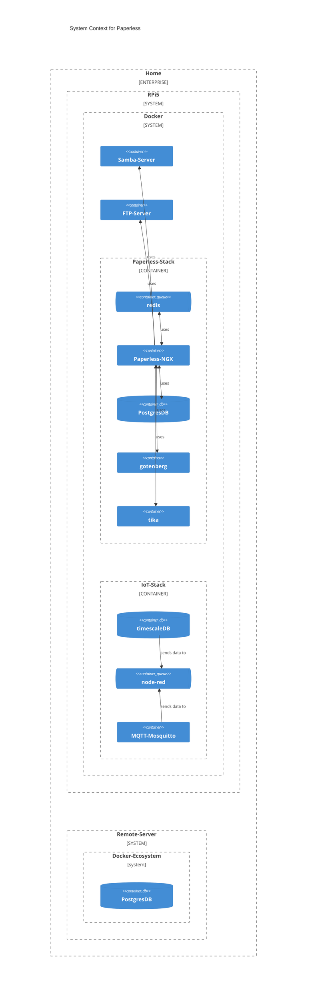

# When will it be finished?

- i am lazy :'D
- idk: probably end of 25Q2 or later 

# yet another paperless-stack with some gadgets.

todo: general description

- some of the code is just copy-paste from the official paperless repo (because it is a real good basis to begin with todo: link page)
 
## usecases

todo: description (todo: copy-paste)

- intended for just me myself and i as single user AND local use within the local network only. 
- nothing special. just managing my own docs

## Requirements

todo: description of my requirements (todo: copy-paste)

## realization of RQ

tbd

### WIP paperless-stack

todo: description

### WIP backup

todo: description

- imo more important than the description of the paperless-stack itself.

### WIP prod and test (based on paperless-stack + backup)

todo: description

todo: idea is to be to test and destroy while leaving the prod system unaffected by Layer8Problems

-> based on *backup*
